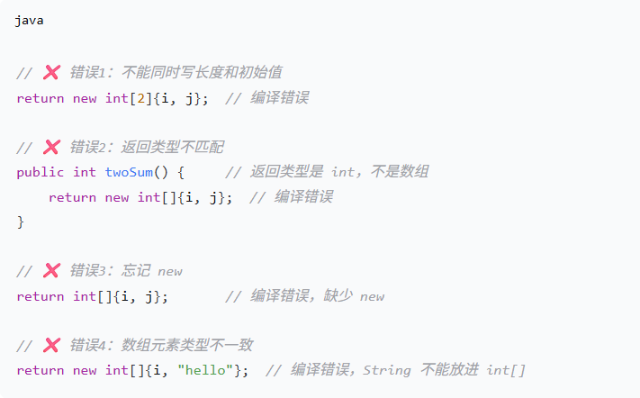
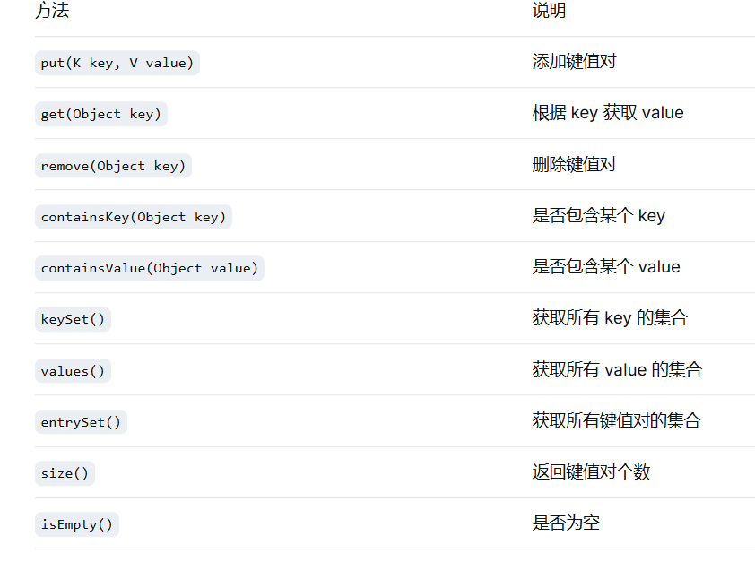

# 0001 - Two Sum

**难度：** Easy
**链接：** https://leetcode.cn/problems/two-sum/

## 题目

给定一个整数数组 `nums` 和一个整数目标值 `target`，请你在该数组中找出和为目标值的那两个整数，并返回它们的数组下标。

## 思路

<!-- 写你的解题思路 -->
https://chat.deepseek.com/share/vwxcg055g6scmqiyl2

## 复杂度
//暴力算法
- 时间复杂度：O(N)^2
- 空间复杂度：O(1)

## 备注

<!-- 踩过的坑、值得记的点 -->

https://chat.deepseek.com/share/u9cn7woc5lolqmdb46